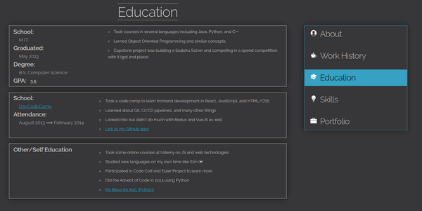

# Resume Site Creator
### _Written in Elm_

This project was built primarily for myself to create a nice looking resume site, while
also learning some Elm along the way.  I decided I could easily generalize the code so
that anyone could use it to make a resume website for themselves as well!

Couple primary notes to start:
1. This will not offer much in the forms of easy customization of the look and feel
of the website or styling.  It is very much a plug-n-play.  
2. I will provide some basic guidance on how you can customize a few of the main colors of
the site, but anything beyond that will be up to you to modify the CSS.
3. This is designed as an SPA using Elm, and should be able to be deployed to a hosted domain.
4. I will not be providing guidance in this README on how to deploy the app, I will leave those details for
the user to decide.
5. This app SHOULD be fully responsive, however I am a self-admittedly terrible UI/UX designer, so the CSS may be a bit wonky.  **I will absolutely accept PRs from people better at CSS than me who want to fix this**

## Now the Fun Stuff

Let's start with a preview of the app:

### About Page


### Work History Page


### Education Page



### Skills Page


### Portfolio Page


## This is magical!  How do I use it?!

Aww thanks.

Using it is pretty easy -- you can fork this repo for yourself, and make any modifications you need.
I will detail what to do in following sections.  I highly recommend (for obvious reasons) that you delete the `images` folder after forking this project, since it is only used for this README for examples.

## Compiling/Running Locally

### Prerequisites

1. You have installed [Elm](https://elm-lang.org/)
2. ....that's it!

### Running the app locally

I have provided a handy little Bash script you can use if you want (Mac/Linux), which you can run with
```
bash buildElm.sh
```

Alternatively (or if you're on Windows) you can start the app by running the following 2 commands:
```
elm make src/Main.elm --optimize --output=public/resume.js
elm reactor
```

You can then navigate to http://localhost:8080/public/index.html and find the About page displayed!

This repo contains a "sample" resume that I defined in `src/Main.elm` that you can modify or play with however you want.  When you are finished with it, you can replace it with your own resume!

## Folder Structure

```
/
├── images/                         
|   └── ...                         sample images -- delete this after forking!
├── public/                         
|   ├── css/                        
|   |   ├── normalize.css           One of two files provided by Skeleton CSS
|   |   ├── override.css            Custom CSS file by me for arranging stuff
|   |   └── skeleton.css            Second of two files provided by Skeleton CSS
|   ├── index.html                  The app HTML page
|   ├── sampleAvatar.png            Example avatar image -- DELETE
|   ├── sampleEmail.png             Example "email image" file -- DELETE
|   └── sampleWebsiteImage.png      Example used for the Portfolio page -- DELETE
├── src/                            
|   ├── ResumePage/                 
|   |   ├── About.elm               Public functions for an "About Me" page
|   |   ├── Education.elm           Public functions for an "Education" page
|   |   ├── Helpers.elm             Helper functions (used internally)
|   |   ├── Portfolio.elm           Public functions for a "Portfolio" page
|   |   ├── Skills.elm              Public functions for a "Skills" page
|   |   ├── Types.elm               Definition of all the Elm types
|   |   └── WorkHistory.elm         Public functions for a "Job History" page
|   ├── Main.elm                    Main Elm file -- define your resume here!
|   └── Resume.elm                  Public functions for building the whole Resume
└── buildElm.sh                     Helper script for compiling/running the app
```

## Customizing the site (a little.)

The 3 main things you can customize if you want would be font, colors, and the Nav bar.

### Font

The font used is [Raleway, by Google](https://fonts.google.com/specimen/Raleway).  You can change this using
a property in `body` in the `public/css/override.css` file.

### Colors

The 3 main colors used are in `public/css/override.css`:

1. **Text/Borders**
  - This is defined as `#C7C7C7`
  - You will need to do a find/replace for that value, used multiple places
    - I don't use a preprocessor, sorry.
2. **Background**
  - This is defined as `#373638`
  - Again, you'll need to do a find/replace.  Sorry :/
3. **Navbar**
  - The blue used in the main app is defined as `#36a1c2`
  - Find and replace, blah blah blah I'm bad at CSS

## Building Your Resume

A resume is defined in the app as a single `Resume` object, defined in `src/ResumePage/Types.elm`.

I have defined a large number of helper types to make building your pages as
modular as possible, and will detail each in the appropriate sections.

**NOTE:** Almost everything in the resume is OPTIONAL.  A basic Resume would be simply a
single "About" page with your Name at the top, and a useless nav bar.  
Everything else can be added as you please.  As such, I will not detail what is optional below.

## Globally-Used Types

#### `InfoItem`

This is used in a lot of pages as essentially an unordered `<li>` item.  2 variants exist:
1. `LinkItem`: This is for displaying a link.  Unfortunately you can't display them inline.
You define a URL for the link, along with "display text" for the link.
2. `TextItem`: This is simple text to display as a `String`

## Pages

**Warning:  I will be speaking a lot in Elm terms from here on out**

### About

This page is primarily contact information, along with a little bio about yourself.

#### `AboutPage`

- `avatar`:  This is a `String` denoting a path to your Avatar.  I recommend an image no bigger than 256x256
- `name`:  This is your full name, as a `String`
- `city`|`stateOrProv`|`country`:  Self explanatory.  You don't need to provide all 3.
- `email`: This is a custom `Email` type where you can display your email in 2 ways:
  - `TextEmail`: This is a simple `String`.  Your email will be formatted on the page as `sample (at) email (dot) com`
  - `ImageEmail`: This is the recommended style -- You can use online utilities to make a PNG from your email and display it.  I recommend matching the text color to the CSS, and using a transparent background.  Also recommend about 35-40px tall to look natural.  The `ImageEmail` is then just a `String` path to the image file.
- `socialLinks`: This is a list of `SocialLink` types to link to any profiles or sites you care to share.
  - Supported:
    - GitHub, Twitter, Facebook, LinkedIn, or raw Website links
  - You can include as many of each link as you like, or none.  Multiple of the same are accepted.
  - The `String` is simply the URL of your profile/website.
- `bio`: This is simply a list of `String`s.  It will display as "paragraphs" (1 per list item).

### Work History

This page is to display your employment history -- Internships, Gigs, College
Jobs, and especially Industry experience!

#### `WorkHistoryPage`

This is merely a list of defined `Job` objects:

#### `Job`

- `employer`:  The name of your employer
- `startDate`: A date, formatted however you want as a string, of when you started.
- `endDate`: Same as above, but when you ended that job.  An empty string is interpreted as `"Present"`.
- `title`: The job title you held most recently for that job.
- `info`: Talk about what you did at this job -- This is defined using `InfoItem`s (described above)

### Education

This page is to display any education you've had that's relevant -- Don't worry if you didn't
go to college!  This provides methods to handle non-standard education too.

#### `EducationPage`

- `formalEducation`: This is used for standard education -- College, University, High School.
- `bootCamps`: Just as you'd expect -- talk about any Code Bootcamps you attended!
- `otherEducation`:  This is a solitary item that's a great space to talk about all kinds of
misc. education you've pursued -- Self education, online courses, practice projects, tutors!

#### `FormalEducation`

- `school`: The name of your school
- `gradDate`: When did you graduate?
- `degree`: Name of the degree(s) you earned
- `gpa`: What was your GPA? (you can also just put `"N/A"` if you want!)
- `info`: Describe some stuff you did in school that might be relevant!  Defined using `InfoItem`s again.

#### `BootCamp`

- `school`: The name of the boot camp you attended
- `website`: Link to the boot camp's homepage (or the course you took)
- `startDate`: When did you start (format how you like)
- `endDate`: When did the course end? (format how you like)
- `info`: Describe the kinds of things you learned, projects you did, skills you gained!  Using `InfoItem`s again.

#### `OtherEducation`

- `notes`: This is a dirt-simple list of `InfoItem`s where you can talk about anything you've done outside
formal methods of education -- Online courses, self-teaching, online tutorials, tutors, etc!

### Skills

This page gives you a very simple and clean way to define any relevant skills you have, and how
you feel about your skills.  It also will provide you a way to give some context to anyone reading
your background, like whether you've used the skill in industry.

#### `SkillsPage`

- `skills`: Simply a list of `Skill` objects that will display as cards

#### `Skill`

- `name`: The name of the skill, language, framework, software, tool, process, etc.
- `rating`: Defined in a series of full or half stars as a `Float` -- `0.0, 0.5, 1.0, 1.5, ..., 5.0`
  - Will be displayed as a star rating in the card
- `blurb`: This is a place to give a single `String` of context about the skill -- use this to give a
better idea to recruiters on what your actual experience is with it beyond "I know the name of this!"

### Portfolio

This page will be for showcasing any projects that you've worked on that you're proud of.
Client websites, personal webapps, GitHub repos, etc.

#### `PortfolioPage`

- `items`: Simply a list of `PortfolioItem`s. Each is displayed as a single large sectioned card

#### `PortfolioItem`

- `title`: The name of the thing you are proud of
- `cards`: Each card defines something about the item you're proud of, defined with `PortfolioCard`s.

#### `PortfolioCard`

There are 3 variants of this, and you can use them in any combination or quantity you want.

##### 1. `TextCard`

This is merely a list of `InfoItem`s that you can use to talk a bit about the thing.
Maybe what tech stack you used, or a short description of what it is.

##### 2. `ImageCard`

You can use a card to display a small image preview of the item if applicable as well

##### 3. `LinkCard`

You can also provide a link of some kind (with display text for the link) to be displayed as a large,
easily clickable/tappable card.
